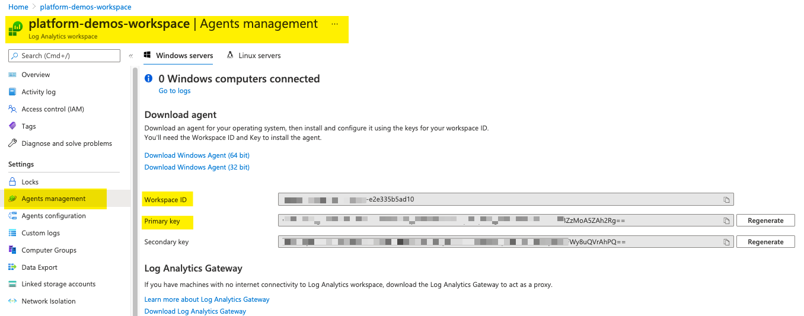

# Setting up Azure Log Analytics Access

This document describes how to connect the `FW2LA` container to a Log Analytics instance.

## Getting the Workspace ID and Workspace Key

The workspace ID and key are provided on the same page as follows:
* Navigate to your workspace page
* On the left hand navigation bar select Settings | Agents management
* This should reveal a panel with the workspace ID and keys as shown:

Copy the ID and one of the keys (either will work), and provide these as environment variables to the `FW2LA` container.

## Regenerating the Workspace Key

If the key is compromised, it is possible to regenerate the key using the Regenerate button. This will revoke all instances of the previous sessions using the old key. It is probably wisest to use the Secondary key for `FW2LA` container to keep it separate from other agents if used at all.